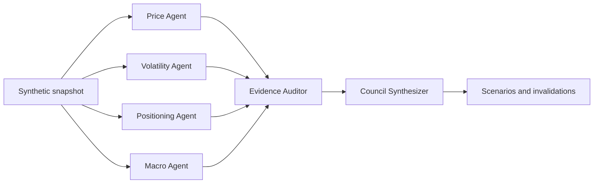

# Market Research Council

Market Research Council is a privacy-safe demonstration of a coordinated multi-agent research workflow. Independent agents examine price structure, volatility, positioning, and the macro environment. An audit agent then challenges timing errors, weak data, and unsupported causal claims before the council produces scenarios with explicit invalidation conditions.

The repository uses synthetic data and simplified public logic. It does not contain employer code, licensed market data, private thresholds, trading positions, or production research artifacts.

## Why this project exists

Market analysis often fails because unlike evidence is collapsed into one narrative. Same-day options volume may be described as new positioning before open interest can confirm it. A volatility-wing comparison may be treated as precise even after its reference strike changes. A confident summary can hide those weaknesses.

This project makes those boundaries part of the software design. Each specialist owns a narrow evidence domain. The auditor can downgrade or exclude evidence before synthesis. The final report preserves uncertainty through scenario probabilities, triggers, and invalidations.

## Workflow



The workflow demonstrates four agent behaviors:

1. **Delegation:** each agent receives the same snapshot but analyzes only its assigned domain.
2. **Structured reporting:** agents return typed evidence with direction, confidence, metrics, and limitations.
3. **Challenge:** the auditor detects temporal misalignment, strike migration, and conflicting conclusions.
4. **Synthesis:** the council excludes critically flawed evidence and produces testable scenarios.

## Quick start

The project has no runtime dependencies outside the Python standard library.

```bash
python -m pip install -e .
market-council data/synthetic_snapshot.json
```

JSON output is also available:

```bash
market-council data/synthetic_snapshot.json --format json
```

Run the tests:

```bash
python -m unittest discover -s tests -v
```

## Example result

The included synthetic snapshot intentionally contains mixed evidence. Price and confirmed longer-dated positioning are constructive, while the volatility surface indicates richer downside protection. The volatility agent also reports strike migration, so the auditor preserves the direction of that observation but lowers confidence in its magnitude.

```text
Regime: constructive
Conviction: medium

Price Agent       bullish   high
Volatility Agent  bearish   medium
Positioning Agent bullish   high
Macro Agent       bullish   medium

Audit: conflicting directional evidence; preserve scenario uncertainty
```

The point is not to predict the synthetic symbol. The point is to show how a research system can keep timing, evidence quality, and falsifiability visible while multiple agents collaborate.

See the complete generated-style output in [example_report.md](example_report.md).

## Repository structure

```text
market-research-council/
├── data/
│   └── synthetic_snapshot.json
├── src/market_research_council/
│   ├── agents.py
│   ├── cli.py
│   ├── models.py
│   └── orchestrator.py
├── tests/
│   └── test_council.py
├── PRIVACY.md
└── pyproject.toml
```

## Design choices

**Deterministic public demo.** The repository runs without an API key, external service, or private dataset. This makes every output reproducible and reviewable.

**Typed handoffs.** Agents exchange evidence objects instead of free-form prose. The synthesizer can therefore distinguish direction, confidence, metrics, and limitations.

**Fail-closed audit.** A critical timing problem removes the affected evidence from synthesis rather than adding a disclaimer after the conclusion.

**Testable conclusions.** The final output includes triggers and invalidations. A later calibration process can compare those statements with observed outcomes.

## Possible extensions

- Add model-backed agents behind the same evidence interface
- Store daily reports and score scenario calibration over time
- Add a debate round in which agents respond to the auditor
- Render an interactive evidence graph
- Connect public market-data sources through isolated adapters

## Privacy and disclaimer

See [PRIVACY.md](PRIVACY.md) for the public-data boundary. This software is an educational engineering demo and does not provide investment advice.
